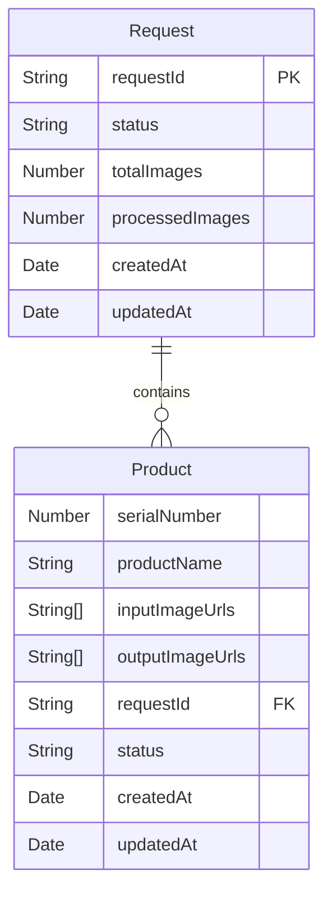

# Entity Relationship Diagram (ERD) - Image Processing System

**Date:** 2025-02-18 04:58:42 UTC
**Author:** pintu kumar

### Diagram

### Entities and Attributes

#### Request

- **requestId**: Unique identifier for the request (Primary Key)
- **status**: Status of the request (e.g., pending, processing, completed, failed)
- **totalImages**: Total number of images to be processed
- **processedImages**: Number of images processed so far
- **createdAt**: Timestamp of when the request was created
- **updatedAt**: Timestamp of when the request was last updated

#### Product

- **serialNumber**: Serial number of the product
- **productName**: Name of the product
- **inputImageUrls**: Array of input image URLs
- **outputImageUrls**: Array of output image URLs
- **requestId**: Reference to the associated request (Foreign Key)
- **status**: Status of the product's image processing (e.g., pending, processing, completed, failed)
- **createdAt**: Timestamp of when the product was created
- **updatedAt**: Timestamp of when the product was last updated

### Relationships

- **Request** to **Product**: One-to-Many relationship
  - A single request can contain multiple products.
  - Each product is associated with one request.
