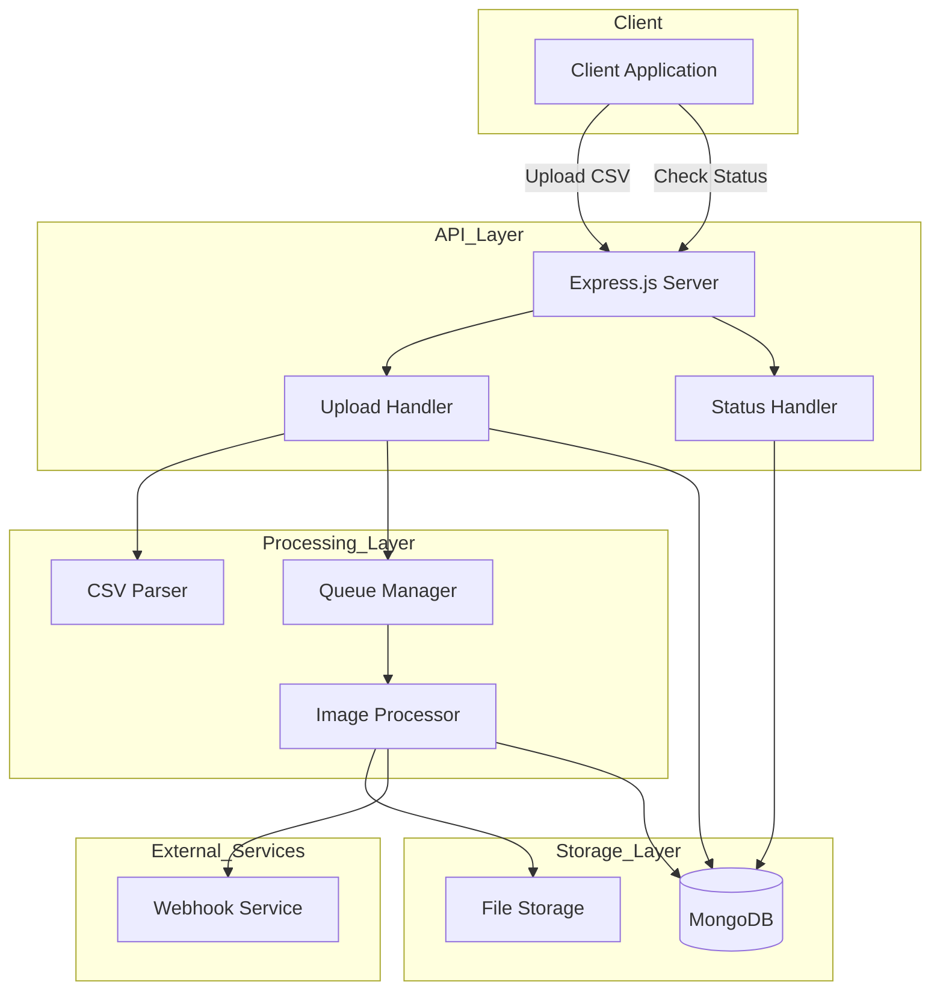
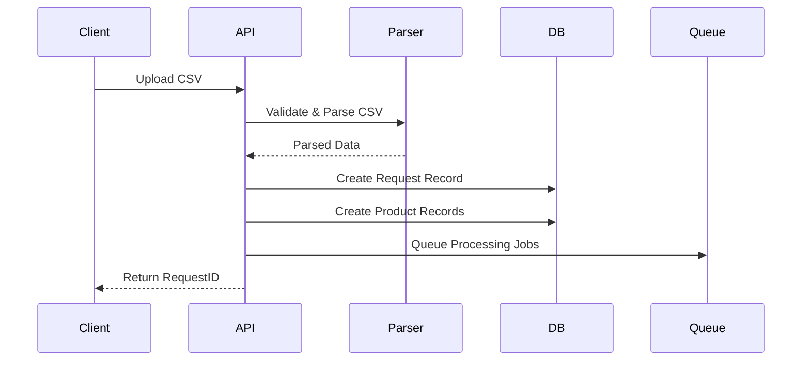
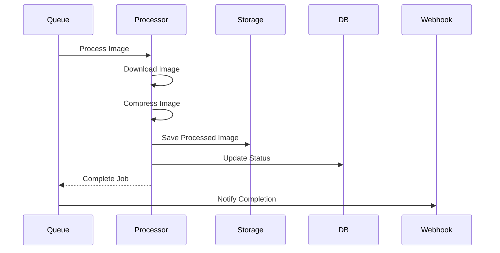
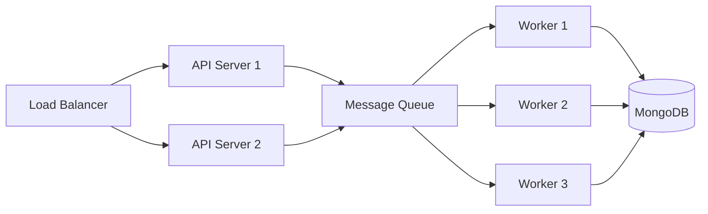

# Low-Level Design Document - Image Processing System

**Date:** 2025-02-18
**Author:** pintu kumar

## 1. System Architecture Overview

### 1.1 Component Diagram



## 2. Component Details

### 2.1 API Layer

#### Upload API

- **Endpoint:** `POST /api/upload`
- **Responsibility:** Accepts and validates CSV files
- **Components:**
  - Multer middleware for file upload handling
  - CSV validation middleware
  - Request ID generator
  - Initial database entry creator

#### Status API

- **Endpoint:** `GET /api/status/:requestId`
- **Responsibility:** Provides processing status updates
- **Components:**
  - Request lookup
  - Progress calculator
  - Status aggregator

### 2.2 Processing Layer

#### Image Processor

- **Main Components:**
  - Image downloader
  - Compression processor (Sharp)
  - Image storage manager

#### CSV Parser

- **Features:**
  - Header validation
  - Data format verification
  - URL extraction
  - Data structuring

#### Queue Manager

- **Responsibilities:**
  - Job queuing
  - Processing orchestration
  - Rate limiting
  - Error handling

### 2.3 Storage Layer

#### MongoDB Schema Design

```javascript
// Request Schema
{
  requestId: String,
  status: String,
  totalImages: Number,
  processedImages: Number,
  createdAt: Date,
  updatedAt: Date
}

// Product Schema
{
  serialNumber: Number,
  productName: String,
  inputImageUrls: [String],
  outputImageUrls: [String],
  requestId: String,
  status: String,
  timestamps: true
}
```

#### File Storage

- Organized by requestId
- Compressed images stored with unique identifiers
- Path format: `uploads/{requestId}/{serialNumber}_{index}.jpg`

## 3. Process Flows

### 3.1 CSV Upload Flow



### 3.2 Image Processing Flow



## 4. Error Handling Strategy

### 4.1 Types of Errors

1. **Validation Errors**

   - Invalid CSV format
   - Missing required fields
   - Malformed URLs

2. **Processing Errors**

   - Image download failures
   - Compression errors
   - Storage issues

3. **System Errors**
   - Database connection issues
   - Disk space problems
   - Network failures

### 4.2 Error Handling Approaches

```javascript
// Example Error Handling Implementation
try {
  // Processing logic
} catch (error) {
  if (error instanceof ValidationError) {
    // Handle validation errors
    logger.warn(`Validation error: ${error.message}`);
    return { status: 400, error: error.message };
  }
  if (error instanceof ProcessingError) {
    // Handle processing errors
    logger.error(`Processing error: ${error.message}`);
    await failJob(jobId);
    return { status: 500, error: "Processing failed" };
  }
  // Handle unexpected errors
  logger.error(`System error: ${error.stack}`);
  await notifyAdmin(error);
  return { status: 500, error: "Internal server error" };
}
```

## 5. Performance Considerations

### 5.1 Optimization Strategies

1. **Batch Processing**

   - Process multiple images concurrently
   - Use worker pools for CPU-intensive tasks
   - Implement smart queuing

2. **Resource Management**

   - Implement rate limiting
   - Memory usage optimization
   - Disk space management

3. **Caching**
   - Cache frequently accessed status information
   - Cache processed image metadata
   - Implement Redis for distributed caching (optional)

### 5.2 Scalability



## 6. Monitoring and Logging

### 6.1 Metrics to Track

- Request processing time
- Queue length
- Error rates
- Storage usage
- Processing success rate

### 6.2 Logging Strategy

```javascript
// Logging Levels
{
  error: 'Serious errors that need immediate attention',
  warn: 'Warning conditions that should be checked',
  info: 'Normal but significant events',
  debug: 'Detailed debug information'
}
```

## 7. Security Considerations

### 7.1 Input Validation

- CSV file size limits
- File type verification
- URL validation
- Content-type checking

### 7.2 Access Control

- API authentication
- Rate limiting
- Resource access restrictions
- Webhook authentication

## 8. Testing Strategy

### 8.1 Unit Tests

- CSV parser testing
- Image processor testing
- Error handling testing
- Database operations testing

### 8.2 Integration Tests

- API endpoint testing
- End-to-end flow testing
- Webhook integration testing
- Error recovery testing

## 9. Deployment Considerations

### 9.1 Environment Setup

```bash
# Required Environment Variables
PORT=3000
MONGODB_URI=mongodb://localhost:27017/image-processor
WEBHOOK_URL=http://your-webhook-endpoint.com
IMAGE_STORAGE_PATH=./uploads
MAX_FILE_SIZE=10mb
WORKER_POOL_SIZE=4
```

### 9.2 Dependencies

```json
{
  "express": "^4.18.2",
  "mongoose": "^7.5.0",
  "multer": "^1.4.5-lts.1",
  "sharp": "^0.32.5",
  "winston": "^3.10.0"
}
```
