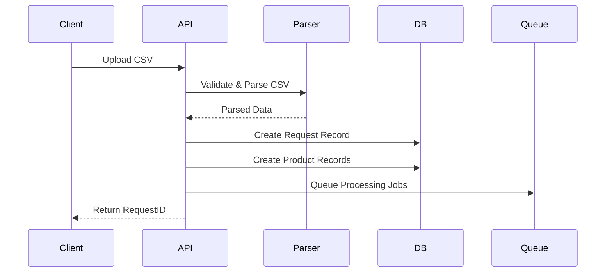
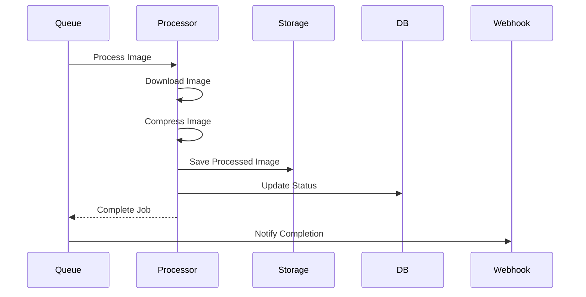
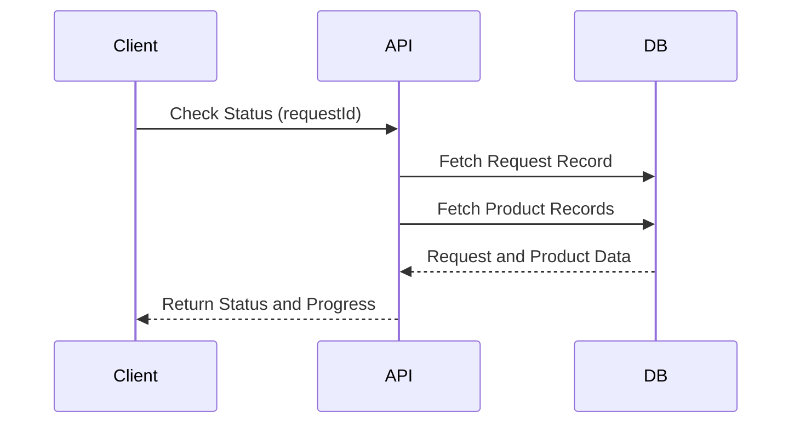

# Sequence Diagram - Image Processing System

**Date:** 2025-02-18 05:00:52 UTC
**Author:** pintu kumar

## 1. CSV Upload Sequence

### Diagram

### Description

1. **Client** uploads the CSV file to the **API**.
2. **API** sends the file to the **Parser** for validation and parsing.
3. **Parser** validates the file format and extracts data, then returns the parsed data to the **API**.
4. **API** creates a new request record in the **DB**.
5. **API** creates individual product records in the **DB** for each product in the CSV.
6. **API** queues the processing jobs in the **Queue**.
7. **API** returns the unique request ID to the **Client**.

## 2. Image Processing Sequence

### Diagram

### Description

1. **Queue** sends a processing job to the **Processor**.
2. **Processor** downloads the image from the provided URL.
3. **Processor** compresses the image using Sharp.
4. **Processor** saves the processed image to **Storage**.
5. **Processor** updates the processing status in the **DB**.
6. **Processor** completes the job and notifies the **Queue**.
7. **Queue** triggers the **Webhook** to notify completion of the processing.

## 3. Status Check Sequence

### Diagram

### Description

1. **Client** requests the status of a processing job by providing the request ID to the **API**.
2. **API** fetches the request record from the **DB**.
3. **API** fetches the associated product records from the **DB**.
4. **DB** returns the request and product data to the **API**.
5. **API** calculates the progress and status, then returns the information to the **Client**.

This Sequence Diagram provides a clear visualization of the interactions between different components in the image processing system during the CSV upload, image processing, and status check sequences.
